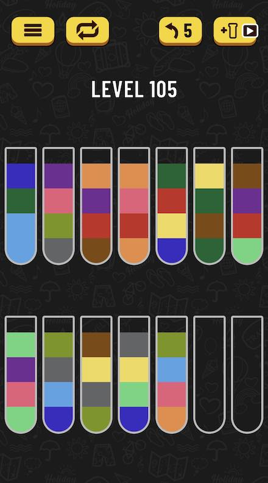

# GO Water Sort Puzzle Solver

Solves Water Sort Puzzle games, you can find the game here:
[Android](https://play.google.com/store/apps/details?id=com.gma.water.sort.puzzle),
[IOS](https://apps.apple.com/us/app/water-sort-puzzle/id1514542157).

Download the game, it is fun if you like that sort of games. 

Got stuck in level 105, so I am implementing a solver. 

Solution is a trivial exhaustive search, details:
- relatively small data structure (56 bytes, cache friendly)
- no play-out will be tried twice, to avoid potential infinite loops and prune search space
- avoids moving solved vials into empty vials

Further improvements:
- Find the shortest solution
- Don't move a vial with just one color into an empty one (it would end up being the same problem)




```shell script
$ make run
[...]
Solving Level 105
Move  1:  2 -> 13
Move  2:  3 -> 14
Move  3:  3 -> 13
Move  4:  4 -> 14
Move  5:  2 ->  4
Move  6:  9 ->  2
Move  7: 12 ->  2
Move  8: 11 ->  9
Move  9:  6 -> 11
Move 10:  5 ->  6
Move 11:  5 ->  3
Move 12: 11 ->  5
Move 13:  8 -> 11
Move 14:  8 -> 13
Move 15:  4 ->  8
Move 16:  4 ->  3
Move 17:  4 -> 14
Move 18:  3 ->  4
Move 19:  7 ->  3
Move 20: 10 ->  3
Move 21:  7 -> 13
Move 22:  7 ->  4
Move 23:  7 -> 11
Move 24:  3 ->  7
Move 25:  5 ->  3
Move 26:  1 ->  5
Move 27: 10 ->  3
Move 28:  9 -> 10
Move 29:  9 -> 12
Move 30:  5 ->  9
Move 31:  1 ->  5
Move 32: 12 ->  1
Move 33:  6 ->  5
Move 34:  6 ->  7
Move 35:  5 ->  6
Move 36:  2 ->  5
Move 37: 10 ->  2
Move 38:  5 -> 10
Move 39:  8 ->  5
Move 40: 12 ->  5
Move 41: 11 ->  8
Move 42:  9 -> 11
Move 43: 12 ->  9
Move 44:  9 -> 14
```


